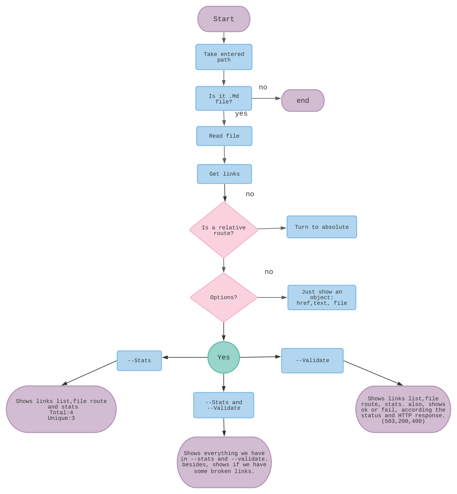

# Markdown Links




## 1. Preámbulo

[Markdown](https://es.wikipedia.org/wiki/Markdown) es un lenguaje de marcado
ligero muy popular entre developers. Es usado en muchísimas plataformas que
manejan texto plano (GitHub, foros, blogs, ...), y es muy común
encontrar varios archivos en ese formato en cualquier tipo de repositorio
(empezando por el tradicional `README.md`).

Estos archivos `Markdown` normalmente contienen _links_ (vínculos/ligas) que
muchas veces están rotos o ya no son válidos y eso perjudica mucho el valor de
la información que se quiere compartir.

Dentro de una comunidad de código abierto, nos han propuesto crear una
herramienta usando [Node.js](https://nodejs.org/), que lea y analice archivos
en formato `Markdown`, para verificar los links que contengan y reportar
algunas estadísticas.


## 2. Como usarlo

******************************************

## Instalar CLI

  <kbd>
      $ npm install -g angelicabonilla/md-links
  </kbd>

## Uso CLI
  Recibe como argumento un archivo ".md" o una carpeta que contenga un archivo ".md".

  *Al ejecutar el comando, te imprime un arreglo de objetos con las url, la referencia dada al enlace, el archivo donde se encontró el enlace*

  <kbd>
    $ md-links ./README.md
  </kbd>

 ```
    {
    href: 'https://es.wikipedia.org/wiki/Markdown',
    text: 'Markdown',
    file: 'C:\\Users\\angel\\Documents\\Repositories\\bog001-md-links\\README.md'
  },
  ```

  *Si ejecutas el comando con  --validate, verifica el status de los links*

  <kbd>
    $ md-links ./README.md  --validate
  </kbd>

 ```
   {
    href: 'https://nodejs.org/api/fs.html#fs_fs_readfile_path_options_callback',
    text: 'Leer un archivo',
    file: 'C:\\Users\\angel\\Documents\\Repositories\\bog001-md-links\\README.md',
    status: 200,
    ok: true
  },
   ```
  *Si ejecutas el comando con --stats, te muestra cuantos enlaces hay en total y cuantos son únicos*

  <kbd>
    $ md-links ./README.md --stats
  </kbd>

 ```
  {
    href: 'https://medium.com/netscape/a-guide-to-create-a-nodejs-command-line-package-c2166ad0452e',
    text: 'Linea de comando CLI',
    file: 'C:\\Users\\angel\\Documents\\Repositories\\bog001-md-links\\README.md'
  }
] { total: 51, unique: 46 }
 ```

  *Si ejecutas el comando con --validate --stats, verifica el status de los links y te imprime cuantos enlaces hay en total, cuantos son únicos y cuantos están rotos*

   <kbd>
  $ md-links ./README.md --stats --validate
  </kbd>

 ```
 {
    href: 'https://medium.com/netscape/a-guide-to-create-a-nodejs-command-line-package-c2166ad0452e',
    text: 'Linea de comando CLI',
    file: 'C:\\Users\\angel\\Documents\\Repositories\\bog001-md-links\\README.md',
    status: 200,
    ok: true
  }
] { total: 51, unique: 46, broken: 1 }
 ```

## Instalar como Modulo


Github Packages
  <kbd>
      $ npm install angelicabonilla/md-links
  </kbd>

## Uso del Modulo

  <kbd>
      const mdlinks = require('@angelicabonilla/md-links')
  </kbd>

  *Muestra un arreglo de objetos con las url y  el archivo donde se encontró el enlace*
```
mdlinks('./README.md')
  .then((res) => {
    console.log(res);
  })
```
  *Muestra un arreglo de objetos con las url, el archivo donde se encontró el link y verifica cada uno de los links, imprimiendo así el status de cada link*
```
mdlinks('./README.md', { validate: true})
  .then((res) => {
    console.log(res);
  })
```
  *Devuelve las estadísticas de los links en el archivo, cuantos hay en total y cuantos son únicos*
```
mdlinks('./README.md', { stats: true})
  .then((res) => {
    console.log(res);
  })
```
  *Muestra las estadísticas de los links  en el archivo, cuantos hay en total, cuantos son únicos y cuales están rotos*
```
mdlinks('./README.md', { validate: true, stats: true})
  .then((res) => {
    console.log(res);
  })
```

*****************************************************************
## 3. Objetivos de aprendizaje
### JavaScript

* [x] Uso de condicionales (if-else | switch | operador ternario)
* [x] Uso de funciones (parámetros | argumentos | valor de retorno)
* [x] Manipular arrays (filter | map | sort | reduce)
* [x] Manipular objects (key | value)
* [x] Uso ES modules ([`import`](https://developer.mozilla.org/en-US/docs/Web/JavaScript/Reference/Statements/import)
| [`export`](https://developer.mozilla.org/en-US/docs/Web/JavaScript/Reference/Statements/export))
* [x] Diferenciar entre expression y statements.
* [x] Diferenciar entre tipos de datos atómicos y estructurados.
* [x] [Uso de callbacks.](https://developer.mozilla.org/es/docs/Glossary/Callback_function)
* [x] [Consumo de Promesas.](https://scotch.io/tutorials/javascript-promises-for-dummies#toc-consuming-promises)
* [x] [Creación de Promesas.](https://www.freecodecamp.org/news/how-to-write-a-javascript-promise-4ed8d44292b8/)

### Node

* [x] Uso de sistema de archivos. ([fs](https://nodejs.org/api/fs.html), [path](https://nodejs.org/api/path.html))
* [x] Instalar y usar módulos. ([npm](https://www.npmjs.com/))
* [x] Creación de modules. [(CommonJS)](https://nodejs.org/docs/latest-v0.10.x/api/modules.html)
* [x] [Configuración de package.json.](https://docs.npmjs.com/files/package.json)
* [x] [Configuración de npm-scripts](https://docs.npmjs.com/misc/scripts)
* [x] Uso de CLI (Command Line Interface - Interfaz de Línea de Comando)

### Testing

* [ ] [Testeo unitario.](https://jestjs.io/docs/es-ES/getting-started)
* [ ] [Testeo asíncrono.](https://jestjs.io/docs/es-ES/asynchronous)
* [ ] [Uso de librerias de Mock.](https://jestjs.io/docs/es-ES/manual-mocks)
* [ ] Uso de Mocks manuales.
* [ ] Testeo para múltiples Sistemas Operativos.

### Estructura del código y guía de estilo

* [x] Organizar y dividir el código en módulos (Modularización)
* [x] Uso de identificadores descriptivos (Nomenclatura | Semántica)
* [ ] Uso de linter (ESLINT)

### Git y GitHub

* [x] Uso de comandos de git (add | commit | pull | status | push)
* [x] Manejo de repositorios de GitHub (clone | fork | gh-pages)
* [x] Colaboración en Github (branches | pull requests | |tags)
* [ ] Organización en Github (projects | issues | labels | milestones)

### HTTP

* [x] Verbos HTTP ([http.get](https://nodejs.org/api/http.html#http_http_get_options_callback))

### Fundamentos de programación

* [ ] [Recursión.](https://www.youtube.com/watch?v=lPPgY3HLlhQ)


* [ ] Puede instalarse via `npm install --global <github-user>/md-links`

### `README.md`

* [x] Un board con el backlog para la implementación de la librería.
* [x] Documentación técnica de la librería.
* [x] Guía de uso e instalación de la librería

### API `mdLinks(path, opts)`

* [x] El módulo exporta una función con la interfaz (API) esperada.
* [x] Implementa soporte para archivo individual
* [x] Implementa soporte para directorios
* [x] Implementa `options.validate`

### CLI

* [x] Expone ejecutable `md-links` en el path (configurado en `package.json`)
* [x] Se ejecuta sin errores / output esperado
* [x] Implementa `--validate`
* [x] Implementa `--stats`

### Pruebas / tests

* [ ] Pruebas unitarias cubren un mínimo del 70% de statements, functions,
  lines, y branches.
* [ ] Pasa tests (y linters) (`npm test`).
